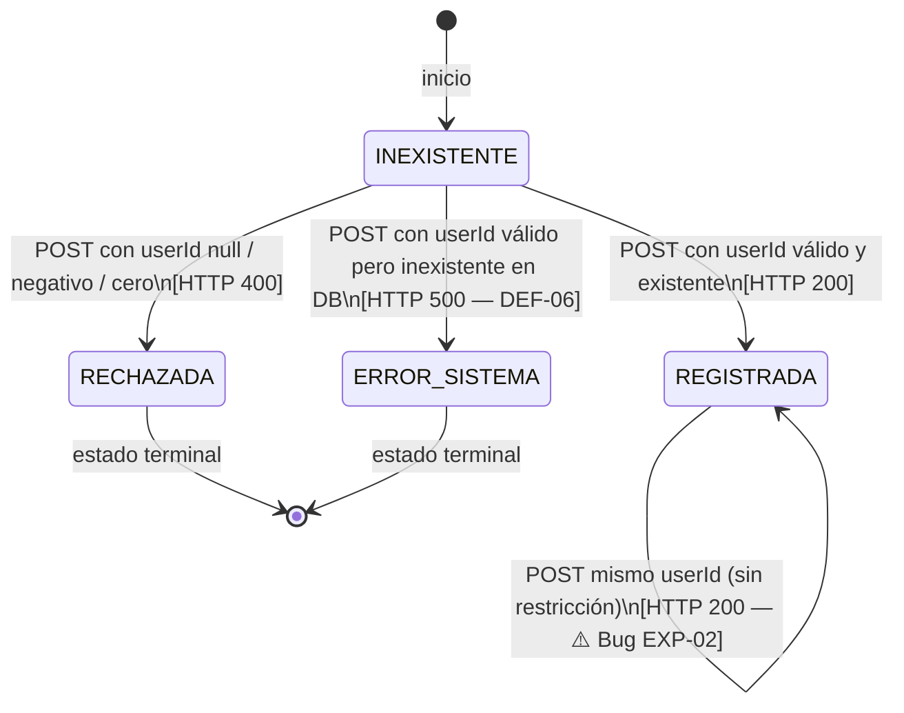

# Pruebas Basadas en Estados — Entidad Attendance

**Proyecto:** Power Strike  
**Materia:** Ingeniería de Software II — IUA  
**Hito:** 4  
**Técnica:** Pruebas de Transición de Estados (State Transition Testing)  
**Responsable:** Martín Mousist  
**Fecha:** 01/06/2026

---

## 1. Técnica aplicada

Las pruebas de transición de estados se aplican cuando el sistema tiene **estados discretos** y reglas sobre las transiciones válidas e inválidas entre ellos. El objetivo es:

- Cubrir cada **estado** al menos una vez (state coverage).
- Ejecutar cada **transición válida** al menos una vez (transition coverage).
- Intentar **transiciones inválidas** y verificar que el sistema las rechace.

> *"Los bugs más comunes: dejar transiciones inválidas sin bloquear."* — Clase 19, IS2

---

## 2. Entidad analizada: Attendance (Asistencia)

Se eligió la entidad `Attendance` porque modela un ciclo de vida con restricciones claras: una asistencia se registra, puede ser rechazada por datos inválidos, o puede fallar por datos inconsistentes. El sistema actual no implementa todas las restricciones esperadas, lo que hace a esta entidad especialmente interesante para pruebas de estado.

**Operaciones disponibles en la API:**

| Endpoint | Descripción |
|---|---|
| `POST /api/attendances` | Registrar asistencia |
| `GET /api/attendances` | Listar todas las asistencias |
| `GET /api/attendances/user/{id}` | Listar asistencias de un usuario |

No existe `PUT` ni `DELETE` para asistencias — son inmutables una vez registradas.

---

## 3. Diagrama de estados

**Descripción de estados:**

| Estado | Descripción |
|---|---|
| `INEXISTENTE` | No existe ningún registro de asistencia para ese intento |
| `REGISTRADA` | La asistencia fue persistida exitosamente en la base de datos |
| `RECHAZADA` | El request fue rechazado en la capa de validación (datos inválidos) |
| `ERROR_SISTEMA` | El sistema encontró un error interno (usuario no encontrado en DB) |

**Estados terminales:** `RECHAZADA`, `ERROR_SISTEMA` (no generan registro en la base de datos).

---

## 4. Tabla de transiciones válidas e inválidas

| Tipo | Estado origen | Evento / Condición | Estado destino | HTTP |
|---|---|---|---|---|
| Válida | INEXISTENTE | userId existente y positivo | REGISTRADA | 200 |
| Válida | INEXISTENTE | userId = null | RECHAZADA | 400 |
| Válida | INEXISTENTE | userId negativo (ej: -1) | RECHAZADA | 400 |
| Válida | INEXISTENTE | userId = 0 (borde) | RECHAZADA | 400 |
| Esperada inválida | INEXISTENTE | userId positivo pero inexistente en DB | ERROR_SISTEMA | 500 ⚠️ |
| Válida | REGISTRADA | GET /attendances | REGISTRADA | 200 |
| Inválida no bloqueada | REGISTRADA | POST mismo userId (mismo día) | REGISTRADA | 200 ⚠️ |

> ⚠️ Las filas marcadas representan comportamientos incorrectos del sistema actual, documentados como defectos.

---

## 5. Casos de prueba derivados

Los siguientes casos cubren todas las transiciones del diagrama:

| ID | Estado inicial | Acción | Datos de entrada | Resultado esperado | Resultado real | Estado |
|---|---|---|---|---|---|---|
| ME-01 | INEXISTENTE | POST /attendances | userId=2 (Juan Pérez, existente) | HTTP 200, REGISTRADA | HTTP 200 | ✅ PASA |
| ME-02 | INEXISTENTE | POST /attendances | userId=null | HTTP 400, RECHAZADA | HTTP 400 | ✅ PASA |
| ME-03 | INEXISTENTE | POST /attendances | userId=-1 | HTTP 400, RECHAZADA | HTTP 400 | ✅ PASA |
| ME-04 | INEXISTENTE | POST /attendances | userId=0 (borde) | HTTP 400, RECHAZADA | HTTP 400 | ✅ PASA |
| ME-05 | INEXISTENTE | POST /attendances | userId=99999 (inexistente) | HTTP 404, ERROR | HTTP 500 | ❌ FALLA — DEF-EXP-01 |
| ME-06 | REGISTRADA | GET /attendances | — | HTTP 200, lista con registro | HTTP 200 | ✅ PASA |
| ME-07 | REGISTRADA | POST /attendances mismo usuario | userId=2 (ya registrado hoy) | HTTP 409, RECHAZADA | HTTP 200 (acepta) | ❌ FALLA — DEF-EXP-02 |

**Resumen:** 5 casos pasan, 2 fallan. Los fallos corresponden a defectos documentados en `12_defectos_exploratorios.md`.

---

## 6. Cobertura alcanzada

| Cobertura | Resultado |
|---|---|
| State coverage (todos los estados alcanzados) | ✅ 4/4 estados |
| Transition coverage (transiciones válidas ejecutadas) | ✅ 4/4 flechas del diagrama |
| Invalid transition testing (inválidas intentadas) | ✅ ME-05, ME-07 |
| Estados terminales verificados | ✅ RECHAZADA (ME-02, ME-03, ME-04), ERROR_SISTEMA (ME-05) |

---

## 7. Relación con otros artefactos del Hito 4

| Artefacto | Relación |
|---|---|
| `03_tdd_attendance_red.md` | ME-02, ME-03, ME-04 corresponden a AT-01/AT-02/AT-03 del ciclo TDD |
| `10_fmea.md` | ME-07 corresponde al modo de fallo 2 (doble registro, RPN 210) |
| `12_defectos_exploratorios.md` | ME-05 → DEF-EXP-01; ME-07 → DEF-EXP-02 |
